# 🤝 Contributing to DocDoctor

### **Let's build the world's best autonomous codebase intelligence agent together!**

<div align="left">

[](#)
[](#)
[](#)

</div>

---

> [!IMPORTANT]  
> We are committed to building a highly secure, local-first, privacy-respecting developer agent. We welcome all contributions—from structural syntax parsing adjustments to gorgeous glassmorphic frontend micro-interactions. Read through this visual roadmap to get started!

---

## ⚡ The Contribution Pipeline (Visual Flow)

Here is a visual roadmap of how a code contribution goes from a local idea to a merged feature:

```mermaid
flowchart LR
    classDef stage fill:#1e1b4b,stroke:#8b5cf6,stroke-width:2px,color:#f8fafc,rx:8px,ry:8px;
    classDef check fill:#064e3b,stroke:#10b981,stroke-width:2px,color:#f8fafc,rx:8px,ry:8px;
    classDef merge fill:#4c0519,stroke:#ec4899,stroke-width:2px,color:#f8fafc,rx:8px,ry:8px;

    step1["🍴 1. FORK REPO<br>Fork codebase to your GitHub"]:::stage
    step2["🌿 2. CREATE BRANCH<br>Branch off main locally"]:::stage
    step3["💻 3. HACK CODE<br>Implement features type-safe"]:::stage
    step4["🔬 4. VERIFY BUILDS<br>Validate python & tsc compiler checks"]:::check
    step5["🚀 5. SUBMIT PR<br>Open a PR referencing open issues"]:::stage
    step6["🎉 6. CODE MERGED<br>Feature goes live on DocDoctor!"]:::merge

    step1 --> step2
    step2 --> step3
    step3 --> step4
    step4 --> step5
    step5 --> step6
```



---

## 💎 Custom Visual Contribution Guide

Toggle spec sheets below to understand our quality benchmarks:

| Phase Dimension | <span style="background-color: #8b5cf6; color: white; padding: 4px 10px; border-radius: 12px; font-weight: bold; font-size: 11px;">💜 VIOLET CORE: BACKEND SPEC</span> | <span style="background-color: #ec4899; color: white; padding: 4px 10px; border-radius: 12px; font-weight: bold; font-size: 11px;">💗 ROSE STACK: FRONTEND SPEC</span> |
| :--- | :--- | :--- |
| **Logic & Structure** | Modular router bindings inside FastAPI API classes | Isolated React components utilizing Next.js layouts |
| **Performance** | Async background jobs preventing request timeouts | Fluid state context persistent cache in localStorage |
| **Data Persistence** | Dynamic `INSERT OR REPLACE` SQLite key settings | Responsive server payload bindings using fetch streams |
| **Security Standard** | ChromaDB namespace scoping isolated per workspace | Air-gapped compliance options for client settings |

---

## 🚀 Step-by-Step Integration Standards

### 🐛 1. Submitting Bug Reports
* **Check Existing Issues**: Search active boards first to prevent duplicates.
* **Document OS & Stack Specs**: Detail if running Windows, Linux, or macOS.
* **Define AI Router Mode**: Specify if using **Offline (Ollama)** or **Online (Cloud)**.
* **Extract Logs**: Capture terminal traces from backend servers or Next.js consoles.

### 💡 2. Feature & Enhancement Proposals
* Open an issue using the `feature-request` tag.
* Detail the exact developer use-case (e.g., *"Adding a Groq provider integration for sub-second cloud summaries"*).

### 📝 3. Pull Request (PR) Requirements
Before submitting a PR, make sure your local workspace passes compiler checks:

> [!TIP]  
> **Backend Compilation Verification (Python)**:
> ```powershell
> python -m py_compile backend/main.py
> ```

> [!NOTE]  
> **Frontend Type-Safety Verification (TypeScript)**:
> ```powershell
> cd frontend
> npx tsc --noEmit
> ```

---

## ✍️ Creative Commit Message Guidelines

To maintain a clean commit history, format commit titles using these exact badges:

*   `<span style="background-color: #8b5cf6; color: white; padding: 2px 6px; border-radius: 4px; font-weight: bold; font-size: 10px;">feat</span>` ➜ Introducing a new codebase parsing module or switching tool.
*   `<span style="background-color: #ec4899; color: white; padding: 2px 6px; border-radius: 4px; font-weight: bold; font-size: 10px;">fix</span>` ➜ Resolving syntax scanner index exceptions.
*   `<span style="background-color: #10b981; color: white; padding: 2px 6px; border-radius: 4px; font-weight: bold; font-size: 10px;">docs</span>` ➜ Enhancing setup files or markdown diagrams.
*   `<span style="background-color: #f59e0b; color: white; padding: 2px 6px; border-radius: 4px; font-weight: bold; font-size: 10px;">style</span>` ➜ Updating glassmorphic overlays and dashboard layouts.

*Thank you for making DocDoctor the ultimate self-healing codebase intelligence agent!* 🩺✨
