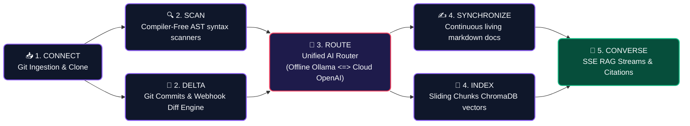
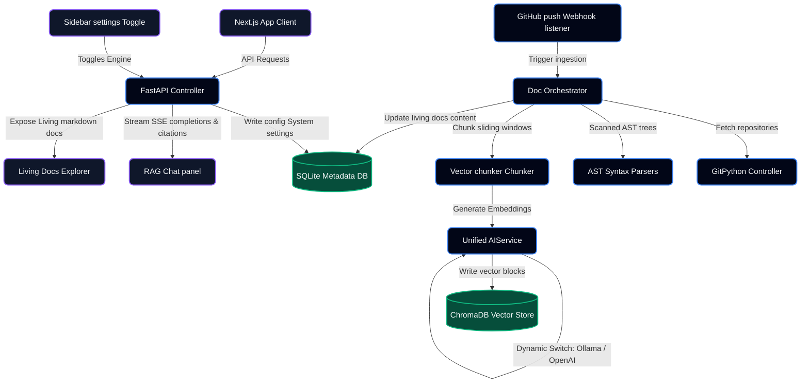

# 🩺 DocDoctor

██████╗  ██████╗  ██████╗    ██████╗  ██████╗  ██████╗████████╗ ██████╗ ██████╗
██╔══██╗██╔═══██╗██╔════╝    ██╔══██╗██╔═══██╗██╔════╝╚══██╔══╝██╔═══██╗██╔══██╗
██║  ██║██║   ██║██║         ██║  ██║██║   ██║██║        ██║   ██║   ██║██████╔╝
██║  ██║██║   ██║██║         ██║  ██║██║   ██║██║        ██║   ██║   ██║██╔══██╗
██████╔╝╚██████╔╝╚██████╗    ██████╔╝╚██████╔╝╚██████╗   ██║   ╚██████╔╝██║  ██║
╚═════╝  ╚═════╝  ╚═════╝    ╚═════╝  ╚═════╝  ╚═════╝   ╚═╝    ╚═════╝ ╚═╝  ╚═╝

### **The Self-Healing Codebase Intelligence Platform & Autonomous Documentation Agent**

<div align="left">

[](#)
[](#)
[](#)
[](#)

</div>

---

> [!IMPORTANT]  
> **DocDoctor** completely cures the developer epidemic of stale, outdated software repositories. Operating directly at the crossroads of static AST syntax trees, sliding-window sliding chunkers, and dynamic switchable local/cloud LLMs, it turns developer push actions into pristine, self-healing, interactive engineering knowledge bases instantly and autonomously.

---

## ⚡ Core Operational Pipeline (Visual Flow)

DocDoctor coordinates codebase scanning, semantic indexing, and document synthesis in a fully automated system loop:



---

## 🎨 Dual-Engine Comparison Matrix

DocDoctor wraps standard AI calls through a **Unified AI Service Wrapper**. Toggle between engines in the Next.js Sidebar console dynamically with single-click persistence:

| Dimension | <span style="background-color: #7c3aed; color: white; padding: 4px 10px; border-radius: 20px; font-weight: bold; font-size: 11px; box-shadow: 0 4px 6px -1px rgba(124, 58, 237, 0.2);">🔌 OFFLINE (LOCAL NODE)</span> | <span style="background-color: #059669; color: white; padding: 4px 10px; border-radius: 20px; font-weight: bold; font-size: 11px; box-shadow: 0 4px 6px -1px rgba(5, 150, 105, 0.2);">☁️ ONLINE (CLOUD NODE)</span> |
| :--- | :--- | :--- |
| 🤖 **Active Model** | `qwen2.5-coder:7b` (Local hardware parameter execution) | `gpt-4o-mini` (Premium cloud semantic reasoning) |
| 🧠 **Embeddings Engine** | `nomic-embed-text` (768 Dimension vectors) | `text-embedding-3-small` (1536 Dimension vectors) |
| 🛡️ **IP Privacy** | 🟢 **100% Air-Gapped Security** (No data leaves local disk) | 🟡 **SSL Encrypted REST Calls** (Routed securely) |
| 💻 **Hardware Resource** | Runs directly on local GPU/VRAM or System CPU/RAM | Runs on remote servers (Zero local footprint) |
| ⚙️ **Instance Binding** | Ollama local daemon (`http://localhost:11434`) | Persistent SQLite token mapping key |

---

## 🌌 System Architecture & Data Flow Map



---

## 🛠️ Tech Stack & Engineering Core

* **High-Performance Backend**: FastAPI (Python 3.9+) with async background execution tasks, running Server-Sent Events (SSE) streaming connections.
* **Vibrant Developer Dashboard**: Next.js 15 (App Router, TypeScript) styled with custom glassmorphism overlays, custom scrollbars, and fluid CSS hover effects.
* **Persistent Vector Vault**: Persisted ChromaDB collection namespaces isolated on a per-repository basis to guarantee zero data leakage.
* **Syntax Extractor Scanners**: Python Abstract Syntax Tree (`ast` module) paired with compiler-free brace-matching regex parsers for JS, TS, Go, Java, and C#.
* **Metadata Warehouse**: SQLite database caching repository configurations, synchronization logs, and historical chat sessions.

---

## 💬 Live RAG Chat Demonstration (Visual HUD)

Here is a visual representation of how the streaming codebase RAG chat renders and cites source files in the Next.js interface:

> **👤 DEVELOPER**: *Explain how the AST syntax tree parser isolates function parameters.*
> 
> **🩺 DOCDOCTOR AGENT**: *(Analyzing repo with 5 retrieved vector snippets)*
> 
> > [!NOTE]  
> > **Retrieved Citations Context Map**:
> > *   📄 [ast_parser.py](file:///c:/Users/bhaskar/Desktop/DocDoctor/backend/parsers/ast_parser.py#L42-L65) (Lines: 42-65) ➜ `class ASTParser`
> > *   📄 [doc_orchestrator.py](file:///c:/Users/bhaskar/Desktop/DocDoctor/backend/agents/doc_orchestrator.py#L110-L128) (Lines: 110-128) ➜ `def _parse_source_file`
> 
> "The structural syntax analyzer extracts class and function boundaries using Python's native `ast` module. The function parameter isolation logic resides inside [ast_parser.py](file:///c:/Users/bhaskar/Desktop/DocDoctor/backend/parsers/ast_parser.py#L42-L65):
> 
> ```python
> def visit_FunctionDef(self, node):
>     # Isolated parameters tracker
>     args = [arg.arg for arg in node.args.args]
>     self.functions.append({
>         "name": node.name,
>         "args": args,
>         "docstring": ast.get_docstring(node),
>         "start_line": node.lineno
>     })
> ```
> This constructs a full parameter signature map dynamically, which is then fed into the RAG vector store pipeline!"

---

## 📡 API Specification & Control HUD

DocDoctor exposes clean REST endpoints for full state control:

### Settings Persistence
* **`GET /api/settings`**  
  Retrieves current AI provider configuration and active OpenAI key mappings.
* **`POST /api/settings`**  
  Persists toggled configurations and keys dynamically in the SQLite settings table.  
  *Payload Blueprint:*
  ```json
  {
    "ai_provider": "local" | "online",
    "openai_api_key": "sk-proj-..."
  }
  ```

### Repository Management
* **`POST /api/repositories`**  
  Registers a codebase, schedules an async background cloning task, and initiates scanning.
* **`POST /api/repositories/{repo_id}/sync`**  
  Triggers a manual delta synchronization check.
* **`DELETE /api/repositories/{repo_id}`**  
  Completely purges database logs, local source checkouts, and vectors in ChromaDB.

### Codebase RAG Conversation
* **`POST /api/chat/query`**  
  Spins up an SSE stream that serves completion tokens word-by-word alongside citation mappings.

---

## 🚀 Getting Started

### 📋 Prerequisites

Ensure **Ollama** is active on your machine and retrieve required open-source models:
```bash
ollama pull qwen2.5-coder:7b
ollama pull nomic-embed-text
```

### ⚡ Direct Execution via Interactive Controllers (Recommended)

DocDoctor features premium, resource-optimized **Interactive Service Controllers** in the root directory that automatically handle startup, limit Node.js memory footprint (preventing device lag/paging), stagger startups, and clean up lingering background zombie processes:

*   **`start-all.bat`**: Full-suite controller allowing staggered start, clean start, active memory safety allocations, or manual cache wiping.
*   **`start-frontend.bat`**: Dedicated frontend controller with safety limits and compiler filters.
*   **`start-backend.bat`**: Dedicated backend manager with port conflict solvers.

**Simply double-click `start-all.bat` in the repository root and choose Option `1`!**

---

## 🧪 Verification & Proof Flows

Follow these simple steps to verify and prove that the entire DocDoctor autonomous codebase indexing and living document engine is running perfectly:

### Proof Flow A: Full Codebase Ingestion
1. Open the DocDoctor dashboard at **`http://localhost:3000`** in your browser.
2. In the **Connection Console** on the right, connect any public GitHub repository or any local folder path (you can use this project path for a quick demo!):
   * **Repository Name**: `DocDoctor`
   * **Clone URL / Local Path**: `c:\Users\bhaskar\Desktop\DocDoctor`
   * **Default Branch**: `main`
3. Tap **INGEST CODEBASE**.
4. DocDoctor will parse the files structurally via AST, generate semantic embeddings, index them into ChromaDB, and build 5 documentation types asynchronously.
5. Go to the **Living Documents** tab (`http://localhost:3000/docs`) to view dynamically generated documentation: `README.md`, `API.md Reference`, `ARCHITECTURE.md`, `ONBOARDING.md`, and **`DEPLOYMENT.md`** with **zero generic placeholders**.
6. Open the **Repository AI Chat** tab (`http://localhost:3000/chat`) and start a codebase-aware conversation (e.g., ask *"Explain how the AST syntax tree parser isolates function parameters"*). It will stream responses with retrieved file citations!

### Proof Flow B: Real-Time Webhook Commit Synchronization
To verify real-time webhook parsing, commit tracking, and incremental documentation updates:
1. Keep the dashboard open at **`http://localhost:3000`**.
2. Open a separate terminal window and run our automated mock push simulator script:
   ```bash
   python C:\Users\bhaskar\.gemini\antigravity\brain\4820b414-50c1-4626-9666-32825db0e953\scratch\mock_push.py
   ```
3. Watch the terminal output accept the payload (`✔ Webhook payload successfully accepted by DocDoctor!`).
4. Look at the browser dashboard—it will immediately refresh in real-time, showing the new commit from developer **`Bhaskar`** (*"Add async JWT user authentication handler and refresh token DB schema"*).
5. Navigate to **Living Documents** ➜ **PR/Commit Summaries** tab to view the newly compiled changelog outlining the technical impact!

### C. Configure Cloud Routing
1. Toggle the sidebar AI Engine to **Online**.
2. Input your OpenAI API Key (`sk-proj-...`) and save.
3. Observe the active node footer transition to **Cloud Node: ONLINE**! Future chat prompts and code indexing will run instantly through premium cloud models with full context.


---

## 🔒 Security Policies

* **Zero-Leakage Vector Isolation**: Each project is bound to its own scoped ChromaDB namespace.
* **Encrypted Key Storage**: API tokens reside strictly in your local SQLite data block, never sent to external servers.
* **Air-Gapped Compliance**: Local mode runs 100% offline, making it completely compliant with enterprise security standards.

---

<div align="center">
🩺 <i>Designed to cure developer documentation syndrome. Go fully autonomous.</i>
</div>
